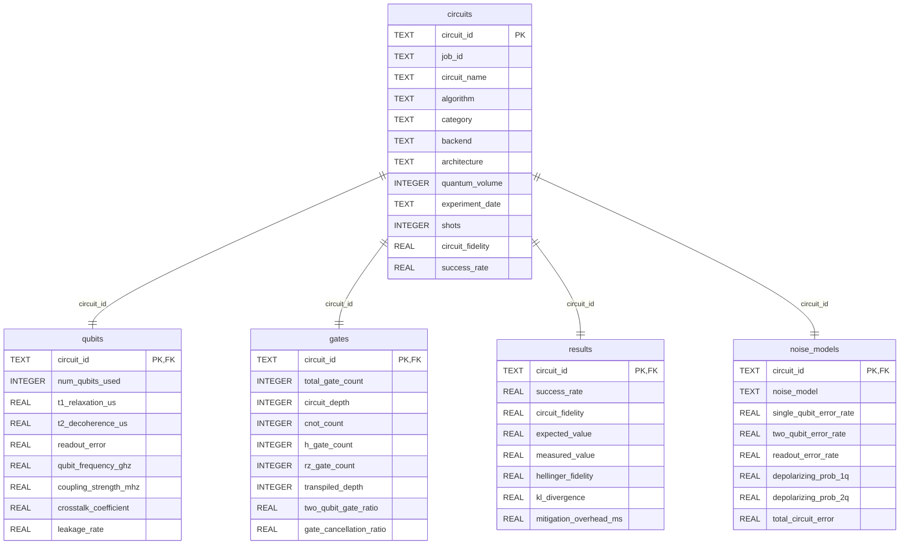

# ER Diagram

The project uses a relational schema with one central table (`circuits`) and four related tables connected by `circuit_id`.

## Mermaid ER Diagram

## Design Notes

- `circuits` stores core metadata and experiment-level KPIs.
- Related tables split domain-specific attributes (hardware, gate composition, run outcomes, and noise profiles).
- This structure reduces duplication and supports efficient joins for analytics.
- Indexes are created for `circuit_id` plus common filter fields (`algorithm`, `backend`, `experiment_date`, `circuit_fidelity`).
